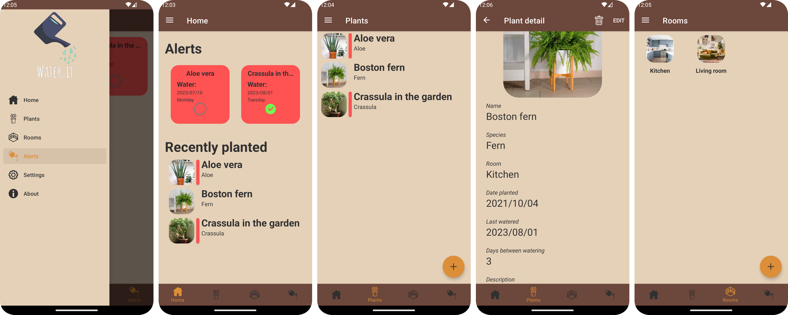

# Water it
Water it is a simple Android app, that helps it's users not only with keeping track of all their plants, but also helping by reminding them when the plant should be watered based on details saved by the user. The user organises his/her plants, which can be organised into rooms. Based on watering periods of plants set by the user, alerts with notifications are sent as reminders to water the respective plant, when the time comes.

## Stack
* Kotlin
* MVVM
* XML with custom views

## App screenshots
